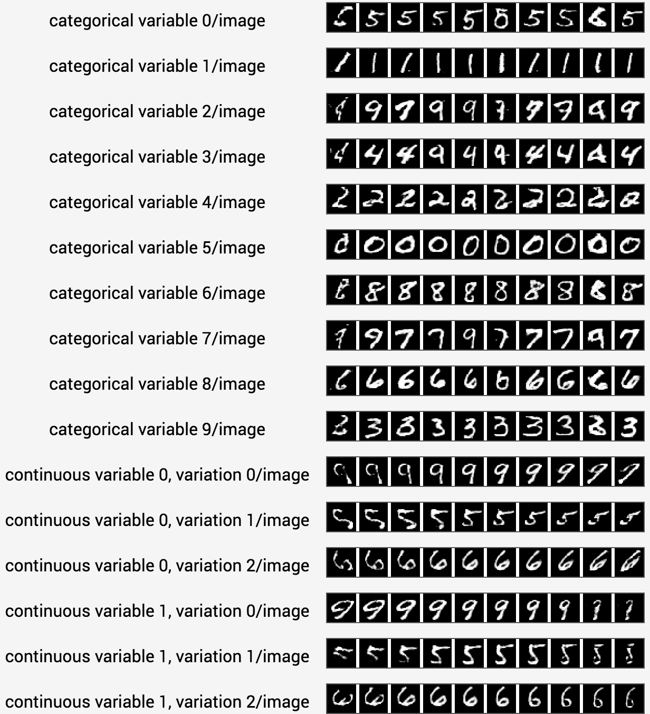

InfoGAN
-------

This repository contains a straightforward implementation of [Generative Adversarial Networks](https://arxiv.org/abs/1406.2661) trained to fool a discriminator that sees real MNIST images, along with [Mutual Information Generative Adversarial Networks (InfoGAN)](https://arxiv.org/abs/1606.03657).

## Usage

* Install tensorflow

Then run for GAN:

```
python3 infogan/__init__.py
```

And InfoGAN:

```
python3 infogan/__init__.py --infogan
```

## Visualization

To see samples from the model during training you can use Tensorboard as follows:

```
tensorboard --logdir MNIST_v1_log/
```

## Expected Result

### GAN

You should now see images like these show up:


### InfoGAN

On tensorboard you should see the following properties emerge:



